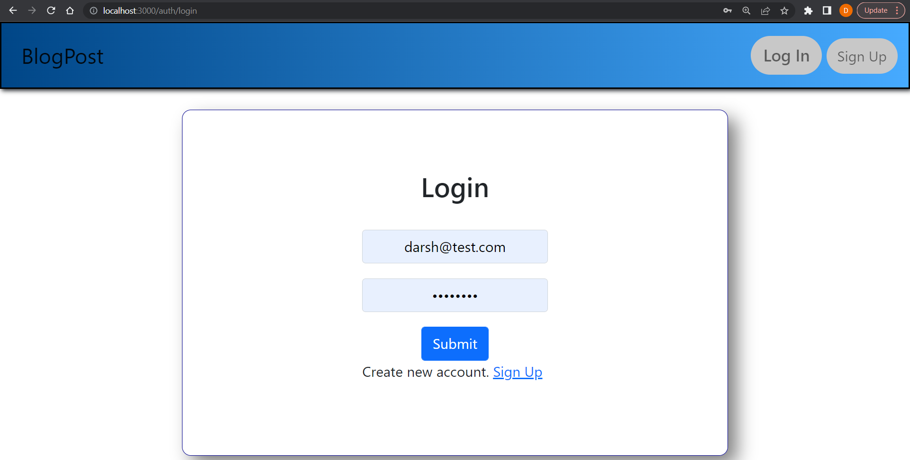

# Blog Application

This is a full-stack blog application built using the MERN stack (MongoDB, Express.js, React.js, Node.js). The application allows users to create, edit, delete, and view blog posts. Users can also register and log in to manage their own blog posts.

## Features

- User Authentication: Sign up, log in, and manage sessions.
- Create, Edit, and Delete Blog Posts: Authenticated users can manage their own posts.
- View Blog Posts: All users can view published blog posts.
- Responsive Design: The application is fully responsive and mobile-friendly.

## Technologies Used

- **MongoDB**: NoSQL database for storing blog posts and user data.
- **Express.js**: Backend framework for handling API requests and routing.
- **React.js**: Frontend library for building the user interface.
- **Node.js**: JavaScript runtime for running the backend server.
- **Mongoose**: ODM for MongoDB, used to interact with the database.
- **Redux**: State management for the frontend application.
- **Bootstrap**: CSS framework for responsive design.

## Installation

To run the application locally, follow these steps:

1. **Clone the repository:**
   ```bash
   git clone https://github.com/darsh0820/blogApp-majorProject.git
   cd blogApp-majorProject
   ```
2. **Install backend dependencies:**
     ```bash
     cd backend
     npm install
     ```
3. **Install frontend dependencies:**
     ```bash
     cd ../frontend
     npm install
     ```
4. **Set up Database connection:**<br>
   Add the MONGODB_URL and PORT in `backend/app.js` to connect.
   ```javascript
   mongoose.connect(MONGODB_URL)
    .then(() => app.listen(PORT))
    .then(() => console.log("Connected to the database and listening to localhost PORT"))
    .catch((err) => console.log(err))
   ```

5. **Run the application:**<br>
   Start the backend server:
   ```bash
   cd backend
   npm start
   ```
   Start the frontend development server:
   ```bash
   cd ../frontend
   npm start
   ```
6. **Access the application:** <br>
   Open your browser and go to http://localhost:PORT to view the application.

## Project Structure
      
      blogApp-majorProject/
      │
      ├── backend/                 # Backend code
      │   ├── models/              # Mongoose models
      │   ├── routes/              # Express routes
      │   ├── controllers/         # Request handlers
      │   └── index.js             # Entry point for the server
      │
      ├── frontend/                # Frontend code
      │   ├── src/
      │   │   ├── components/      # React components
      │   │   ├── store/           # Redux store and reducers
      │   │   ├── App.js           # Main app component
      │   │   └── index.js         # Entry point for the React app
      │   └── public/              # Static assets
      │
      └── README.md                # This README file
      
## Usage
   1. **Register an Account:**
      Click on "Sign Up" to create a new account or "Log In" to sign into your account.
      <div align="center">
	      
      </div>
   3. **Create a Blog Post:**
      After logging in, you can create a blog post.
      <div align="center">
	      
      </div>
   4. **Manage Blog Posts:**
      Edit or delete your posts from your profile page using their respective icons.
      <div align="center">
	      
      </div>
   5. **View Posts:**
      Browse all blog posts on the home page.
      <div align="center">
	      
      </div>

## Contributing
If you’d like to contribute, please fork the repository and use a feature branch. Pull requests are warmly welcome.
